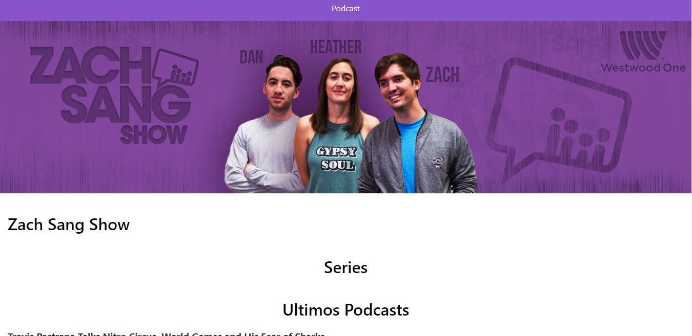

# App de Podcast

App de Podcast integrada con la API de AudioBoom para aprender nextJS

[Ver la Aplicación]()

# ¿Cómo Funciona?

Requiere Node.JS 10

-   `npm install` para instalar las dependencias.
-   `npm run dev` para el entorno de desarrollo.
-   `npm run build && npm start` para el entorno de producción.
